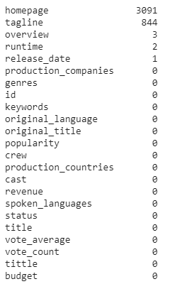
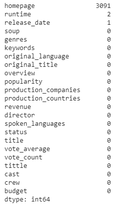

The credits for the Content Based Recommendation System is mainly inspired by Google’s [Blog](https://developers.google.com/machine-learning/recommendation) about recommendation systems.

We used TMDB5000 DATASET from Kaggle.com. The dataset consists of 2 files, namely, tmdb_5000_credits.csv & tmdb_5000_movies.csv.

First We loaded the 2 CSV files into df1 & df2 pandas data frames.

Instead of handling both the data frames, we merged the data frames so that we have to work on a single data frame. The dataset thankfully does not have a large number of empty values. This is the final overview of all the column:

Looking at the id column, which is unique for each movie, we do not need it because it will not contribute to the recommendations. Also, the tagline column should be eliminated because most of the movies have an overview and thus the tagline would result in more of a similar context. Dropping these 2 columns results in a data frame with 21 attributes.

There are multiple columns (see fig 3) where we have a string or node which contains a dictionary. We can use literal_eval from ast module to remove these strings or nodes and get the embedded dictionary. So we use literal_eval for attributes cast, keywords, crew, & genres. Now we have these attributes in the form of a dictionary, we can use these attributes and get important features such as director names, a very important factor for our recommender system. Also for the cast, keywords, & genre attributes, we can return the top 3 names in each category in a list. Now we can create a single column which will a sum of all these 4 attributes, which are very dominant factors for our recommender system. Let’s call this column “soup” (because it’s like a soup/combination of 4 attributes).

Let’s check out the dataset for NaN values now.

Since our homepage has a lot of empty values, we have no other option but to drop it. We can also fill the runtime empty values with the mean value. Since we have one move which is unreleased, we can drop that particular row, since the movie is unreleased. Now we have our final dataset which is ready for some machine learning modeling.

To build our model, we first create a count matrix that is created by the help of a count vectorizer. We create a count vector with English stopwords & fit and transform over the soup column we just created in the previous section. 
Scikit-learn has a very useful method called cosine similarity. It is simply a metric that is used to determine how similar documents are, irrespective of their size. After building the cosine similarity matrix for our dataset, we can now sort the results to find out the top 10 similar movies. We return the movie title & indexes to the user.

